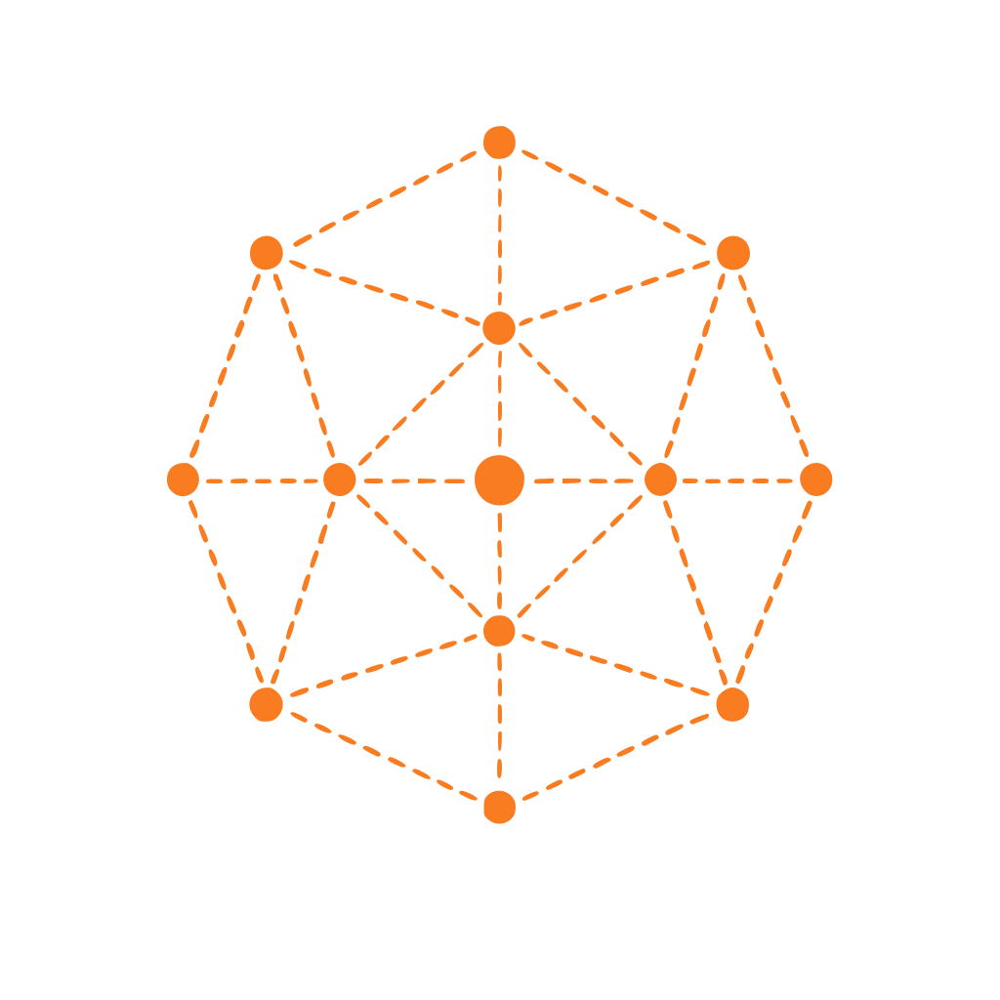

<!-- ========================================================= -->
<!--                  PART 0 · BRAND IDENTITY                  -->
<!-- ========================================================= -->

 
 

# KEYEMBER

### Independent Digital Studio

---

<!-- ========================================================= -->
<!--                     PART 1 · HERO                         -->
<!-- ========================================================= -->

# Hero

### Fast. Reliable. Built to Last.

We create websites, web applications and digital experiences for businesses, entrepreneurs and creators.

 

&nbsp;

  

> **Engineering digital experiences that last.**

---

<!-- ========================================================= -->
<!--                 PART 2 · OUR PHILOSOPHY                   -->
<!-- ========================================================= -->

# Our Philosophy

Technology evolves every day, but strong engineering principles remain timeless.

At **Keyember**, we believe successful software begins with understanding people before writing code. Every project is designed to be reliable, maintainable and built to evolve.

 

<table>
<tr>

<td width="25%" align="center">

## 🎯

### Purpose

Every feature exists for a reason.

</td>

<td width="25%" align="center">

## ✨

### Craftsmanship

Attention to detail at every stage.

</td>

<td width="25%" align="center">

## 📈

### Longevity

Built to grow with your business.

</td>

<td width="25%" align="center">

## 🤝

### Transparency

Clear communication from start to finish.

</td>

</tr>
</table>

 

> **Technology evolves. Great engineering remains.**

---

<!-- ========================================================= -->
<!--                 PART 3 · What We Build                    -->
<!-- ========================================================= -->

# What We Build

Every project is different.

Whether you're starting from scratch or improving an existing platform, we build solutions tailored to your objectives.

## 🌐 Websites

Professional online experiences designed to showcase your business.

- Landing Pages
- Company Websites
- Portfolios
- Showcase Websites

## ⚙️ Applications

Custom software built around your workflow.

- Dashboards
- Admin Panels
- Client Portals
- Business Platforms

## 🔌 APIs & Backend

Reliable services built for integration and scalability.

- REST APIs
- Authentication
- Database Design
- Third-party Integrations

## 🚀 Optimization

Improve existing software instead of rebuilding everything.

- Performance
- Refactoring
- Bug Fixes
- Security

## 📦 Open Source

We actively contribute to the community by sharing projects, libraries and experiments whenever possible.

> **Built around your goals, never around a template.**

---

<!-- ========================================================= -->
<!--                  PART 4 · OUR PROCESS                     -->
<!-- ========================================================= -->

# Our Process

Every successful project starts with a clear process.

From the initial discussion to deployment, every step is designed to keep development transparent, collaborative and predictable.

<table>
<tr>

<td width="20%" align="center" valign="top">

## ①

### Discover

We take the time to understand your goals, challenges and expectations.

</td>

<td width="20%" align="center" valign="top">

## ②

### Plan

Together, we define the best technical solution before development begins.

</td>

<td width="20%" align="center" valign="top">

## ③

### Build

Your project is developed using modern tools and proven engineering practices.

</td>

<td width="20%" align="center" valign="top">

## ④

### Validate

Every feature is reviewed, tested and refined before delivery.

</td>

<td width="20%" align="center" valign="top">

## ⑤

### Launch

Your solution is deployed with confidence and prepared for future growth.

</td>

</tr>
</table>

 

### What this means for you

<table>
<tr>

<td width="25%" align="center">

### 📅

**Clear Planning**

Know what happens next, from start to finish.

</td>

<td width="25%" align="center">

### 🤝

**Transparent Communication**

Regular updates throughout the project.

</td>

<td width="25%" align="center">

### ✅

**Reliable Delivery**

Every feature is validated before release.

</td>

<td width="25%" align="center">

### 📈

**Long-Term Support**

Built to evolve as your business grows.

</td>

</tr>
</table>

 

> **A clear process builds better products.**

---

<!-- ========================================================= -->
<!--              PART 5 · HUMAN + AI ENGINEERING              -->
<!-- ========================================================= -->

# Human + AI Engineering

Artificial intelligence is transforming software development.

At **Keyember**, we use modern AI tools to streamline repetitive tasks, accelerate development and improve productivity while keeping **human expertise** at the center of every project.

> **AI accelerates development. Human expertise guarantees quality.**

## Our Commitment

We believe modern developers should embrace new technologies responsibly.

AI is one of many professional tools we use, alongside Git, Docker, modern frameworks and automated testing.

Every AI-generated suggestion is **reviewed, adapted and validated** before becoming part of a project.

**Nothing is delivered without human approval.**

## 🤖 How  Us

AI helps us work faster without replacing human expertise.

- Technical research
- Boilerplate generation
- Documentation assistance
- Refactoring suggestions
- Debugging assistance
- Development acceleration

## 👨‍💻 Where Humans Take Over

Every critical decision remains under human responsibility.

- Software architecture
- Technical decisions
- Code review
- Security validation
- Performance optimization
- Testing & final approval

## Human + AI in Practice

AI is a productivity tool—not a decision maker.

It allows us to automate repetitive work and spend more time solving complex problems, designing reliable architectures and delivering high-quality software.

| AI Assists With | Human Responsibility |
|-------------|------------------|
| Technical research | Software architecture |
| Boilerplate generation | Technical decisions |
| Documentation drafts | Code review |
| Refactoring ideas | Security validation |
| Debugging assistance | Performance optimization |
| Productivity | Final approval |

### Engineering Principles

> **Modern tools. Human responsibility.**

---

<!-- ========================================================= -->
<!--                  PART 6 · SELECTED WORK                   -->
<!-- ========================================================= -->

# Selected Work

Every project tells a story.

From personal experiments to ambitious open-source initiatives, each repository showcases our commitment to building reliable, maintainable and thoughtfully engineered software.

Rather than chasing quantity, we focus on creating projects that demonstrate modern development practices and solve real problems.

## What You'll Find

Every project published by **Keyember** is built around the same engineering standards.

- Clean and maintainable code
- Scalable architecture
- Modern development practices
- Open-source mindset
- Continuous improvement

 

<!-- ========================================================= -->
<!--                  PROJECT · NATIONAL POKÉDEX               -->
<!-- ========================================================= -->

# 🎴 National Pokédex FR

A modern French Pokédex designed to deliver a fast, intuitive and responsive experience while showcasing clean frontend architecture and structured data management.

### Highlights

- Responsive Design
- Modern User Interface
- Fast Navigation
- Clean Architecture
- Open Source

### Technologies

`HTML` `CSS` `JavaScript`

&nbsp;

 

<!-- ========================================================= -->
<!--                  PROJECT · PUNK RECORDS                   -->
<!-- ========================================================= -->

# 📟 Punk Records · Devil Fruits

An interactive encyclopedia inspired by the One Piece universe, built around structured data, efficient search capabilities and a scalable architecture.

### Highlights

- Structured Database
- Advanced Search
- Responsive Interface
- Scalable Architecture
- Open Source

### Technologies

`HTML` `CSS` `JavaScript`

&nbsp;

 

<!-- ========================================================= -->
<!--                  PROJECT · YOUR NEXT IDEA                 -->
<!-- ========================================================= -->

# 🚀 Your Project Could Be Next

We're continuously designing new products, experimenting with emerging technologies and helping transform ideas into reliable digital solutions.

Whether it's an internal business tool, a custom web application or an open-source initiative, every new project follows the same commitment to quality and long-term maintainability.

&nbsp;

> **Ideas brought to life through code.**
